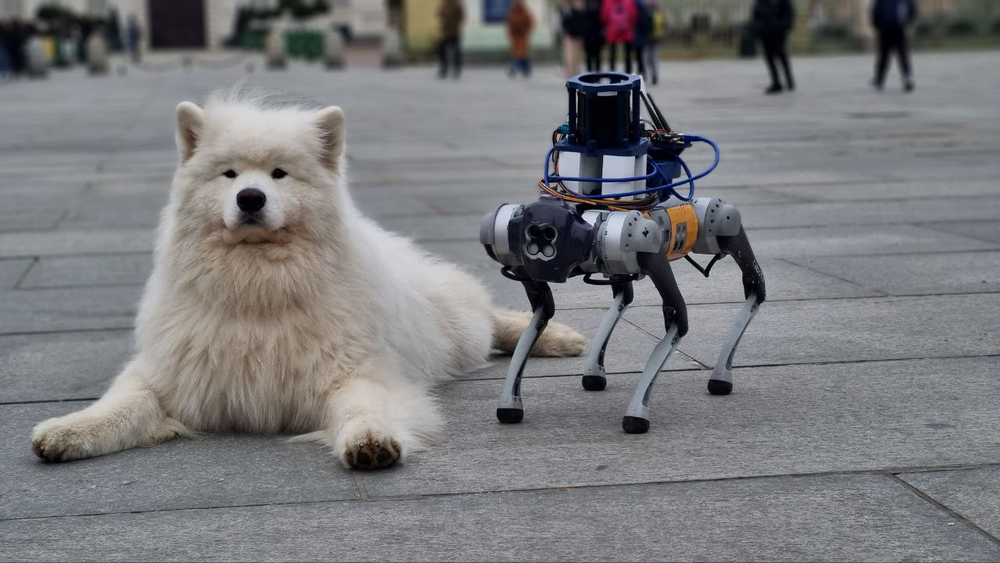
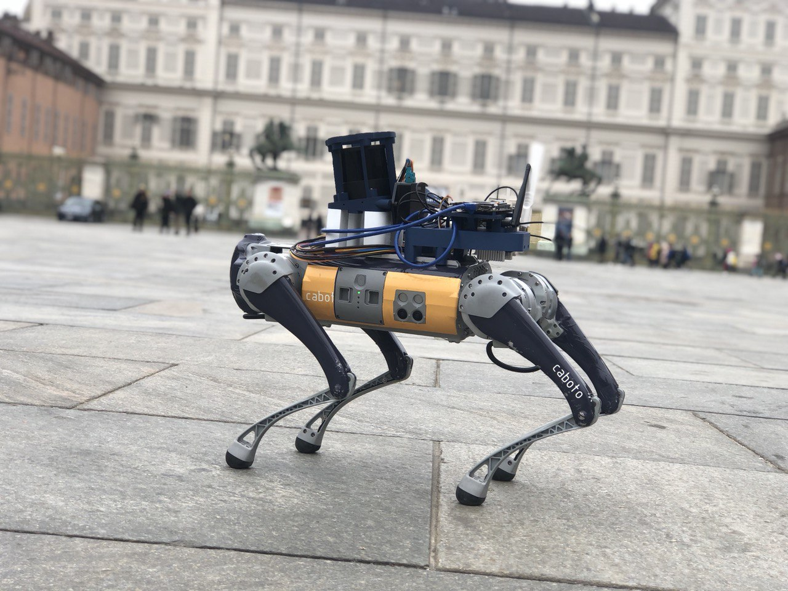
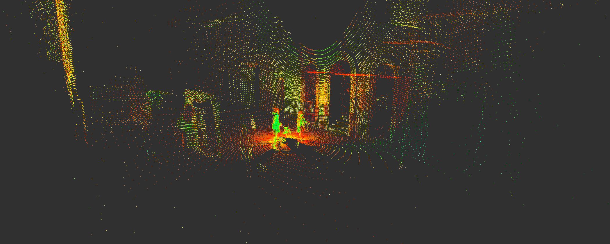
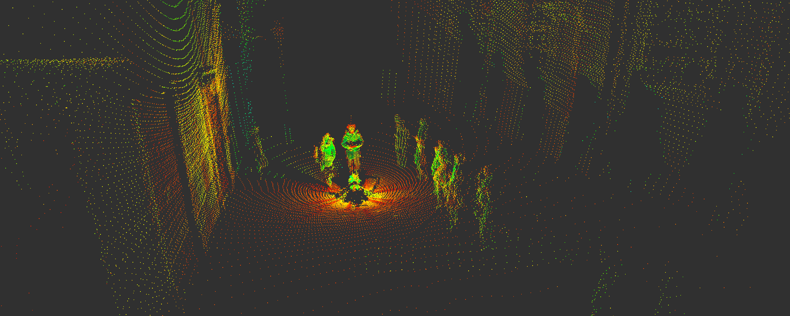
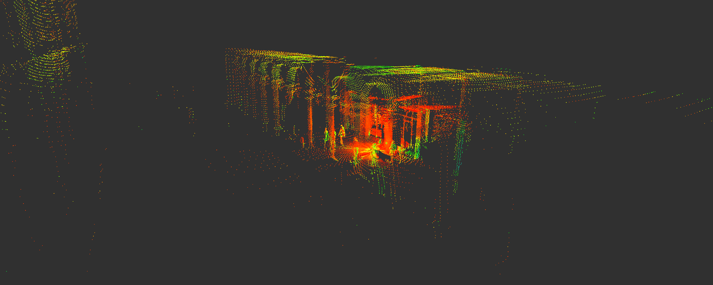
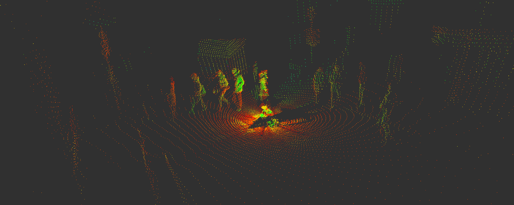
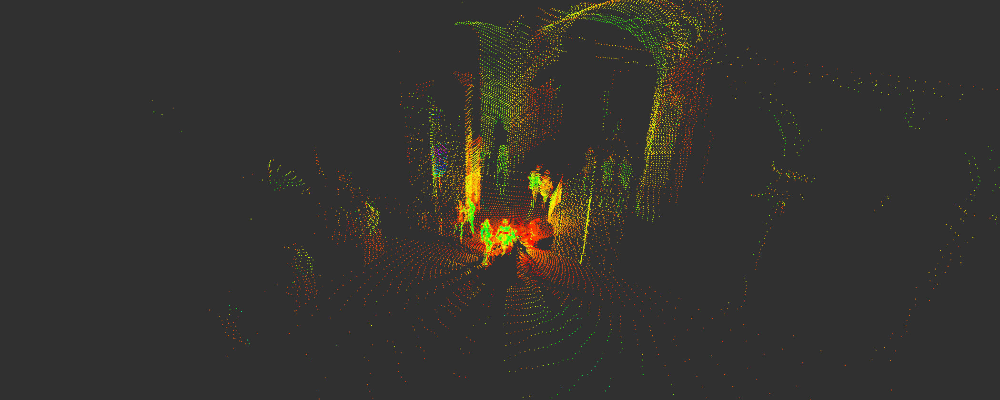

# SAND: Rich Multimodal Dataset Capturing Human-Robot Interactions in Diverse Scenarios

## Overview

SAND is a comprehensive multimodal dataset designed to advance socially-aware robot navigation. Recorded using a Unitree Go1 quadruped robot, SAND captures synchronized streams of high-quality sensor data in real-world, crowded urban settings. The dataset leverages a Hesai QT128 LiDAR—coupled with a state-of-the-art SLAM algorithm that provides precise odometry—and is processed via a system running ROS2 Humble.

Recorded at iconic, bustling locations such as Piazza Castello and Via Roma in Turin, Italy, SAND encompasses a rich variety of data. This includes raw LiDAR point clouds, SLAM-generated maps and odometry, and supplementary sensor streams that together offer a detailed representation of human-robot interactions. The dataset is tailored for researchers in robotics, autonomous navigation, and social robotics, providing a robust resource to benchmark and develop socially aware navigation algorithms.

  <strong>This is not and AI generated image</strong>

## Data Acquisition & System Details

### Recording Sessions
Our dataset comprises four distinct recordings with a combined duration of approximately **1626 seconds**. The details of each session are as follows:

- **Recording 1:**
  - **Size:** 17.1 GiB
  - **Duration:** 305.5 seconds
  - **Messages:** 6117 messages
  - **Location:** Via Cesare Battisti

- **Recording 2:**
  - **Size:** 23.6 GiB
  - **Duration:** 421 seconds
  - **Messages:** 8435 messages
  - **Location:** Via Roma

- **Recording 3:**
  - **Size:** 12 GiB
  - **Duration:** 214 seconds
  - **Messages:** 4300 messages
  - **Location:** Piazza Castello

- **Recording 4:**
  - **Size:** 38.3 GiB
  - **Duration:** 686 seconds
  - **Messages:** 13724 messages
  - **Location:** Piazza Castello and Via Alberto

### Sensor Suite & System Specifications

- **Robot Platform:**
  - The recordings were performed using the **Unitree Go1** quadruped robot, known for its agile locomotion and robust performance.
  - More details about the robot can be found on the [Unitree Go1 Product Page](https://shop.unitree.com/products/unitreeyushutechnologydog-artificial-intelligence-companion-bionic-companion-intelligent-robot-go1-quadruped-robot-dog?srsltid=AfmBOoolAkfvPyK6gfOl0G2-_ozL7nvVu82R6AjaPywBH2e7_77nCqFN).

- **LiDAR Sensor:**
  - We use the **Hesai QT128** LiDAR sensor, operating at 20Hz to capture high-resolution point cloud data essential for SLAM and odometry estimation.
  - For further technical specifications, please refer to the [Hesai QT128 Website](https://www.hesaitech.com/product/qt128/).

- **Recording System:**

  - The recordings were conducted using **ROS2 Humble**, and the robot was teleoperated via a controller to ensure precise maneuvering during data collection.

### Environment Context
The recordings were carried out in dynamic and crowded urban environments in Turin, Italy. The specific locations include:
- **Via Cesare Battisti**
- **Via Roma**
- **Piazza Castello**
- **Via Alberto**

These areas are renowned for their vibrant pedestrian activity and complex urban layouts, making them ideal for evaluating socially-aware navigation algorithms in realistic scenarios.

## Data Structure

The repository is organized by recording sessions. Each session is stored in its own folder containing all raw ROS2 bag files and a metadata file with session-specific information.

### Folder Organization

### Description

- **Recording Folders:**  
  Each `recording_X` folder contains:
  - `metadata.yaml`: Contains session-specific metadata (e.g., location, timestamp, sensor configuration).
  - Multiple ROS2 bag files (`.db3` files) that store the raw sensor data captured during the session.

This clear folder structure allows users to easily navigate and process the dataset for further analysis or integration with robotics applications.

## Sample Visualizations

This section presents sample visualizations that showcase the raw point cloud data captured by the Hesai QT128 LiDAR sensor. The images below display individual frames of the point cloud data, highlighting the intricate details of the surrounding environment as recorded during the sessions.

### Point Cloud Frames
- **Overview:**  
  Each image represents a frame from the raw point cloud data, providing a visual insight into the quality and density of the captured 3D data.
- **Example Frames:**
  - 
  - 
  - 
  - 
  - 

